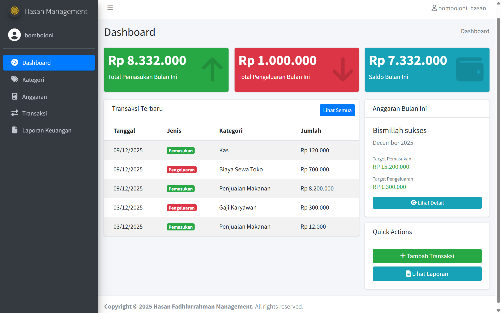
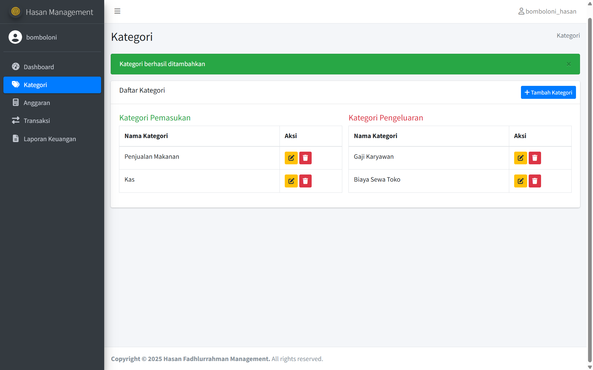
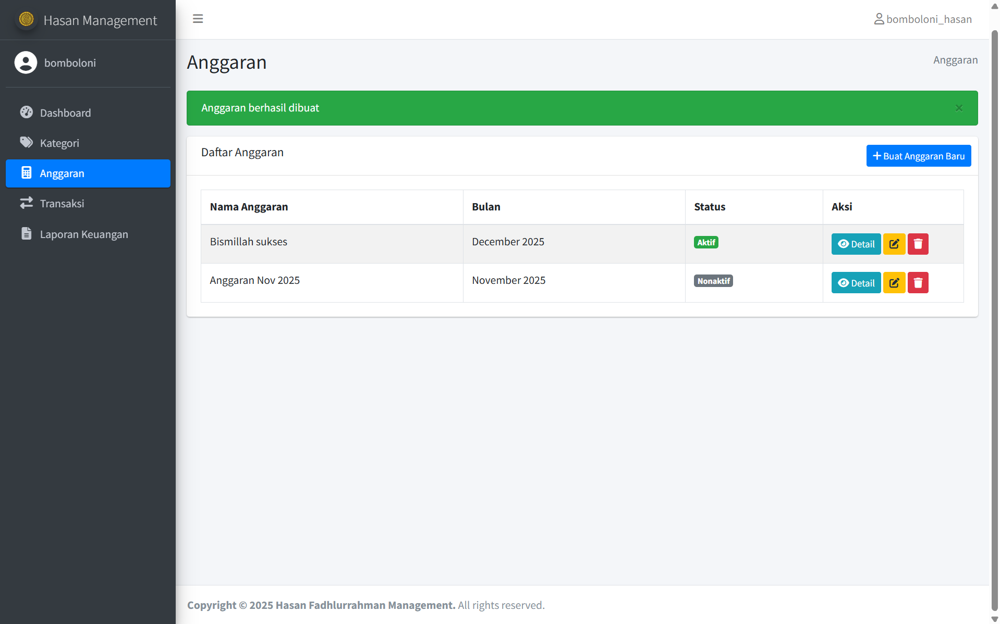
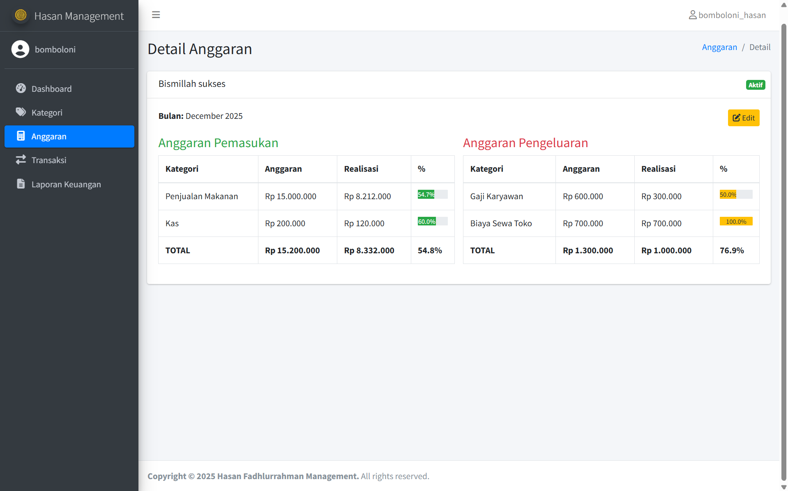
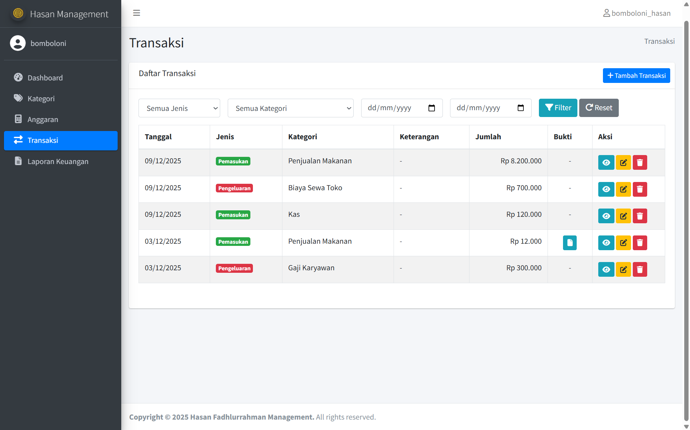
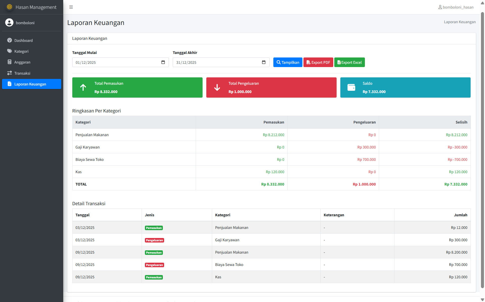
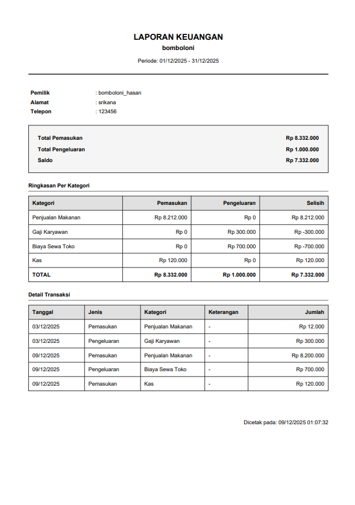

# Gubug Alit System

Sistem manajemen keuangan UMKM berbasis web yang membantu pelaku usaha kecil mengelola keuangan bisnis dengan lebih terstruktur dan efisien.


---

## Deskripsi

**Gubug Alit System** adalah aplikasi manajemen keuangan berbasis web yang dirancang khusus untuk pelaku Usaha Mikro, Kecil, dan Menengah (UMKM). Pengguna dapat mencatat transaksi pemasukan dan pengeluaran dengan upload bukti, menyusun anggaran bulanan per kategori, memantau realisasi anggaran dengan progress bar real-time, dan menghasilkan laporan keuangan komprehensif yang dapat diekspor ke format PDF dan Excel untuk analisis lebih lanjut.

---

## Fitur Utama

### 1. Autentikasi & Manajemen User
- Register akun dengan data UMKM lengkap (nama, alamat, telepon)
- Login dengan email & password
- Session management
- Logout

### 2. Dashboard
- Statistik keuangan bulan berjalan (pemasukan, pengeluaran, saldo)
- Grafik ringkasan dalam bentuk info box berwarna
- Daftar 5 transaksi terbaru
- Status anggaran aktif bulan ini
- Quick actions: Tambah Transaksi & Lihat Laporan

### 3. Manajemen Kategori
- Tambah, edit, dan hapus kategori transaksi
- Pemisahan kategori pemasukan dan pengeluaran
- Tampilan side-by-side untuk kemudahan monitoring
- Validasi kategori yang sudah digunakan

### 4. Penyusunan Anggaran Bulanan
- Buat anggaran bulanan dengan nama dan periode
- Anggaran per kategori (detail untuk setiap jenis transaksi)
- Anggaran total keseluruhan (pemasukan & pengeluaran)
- Status anggaran: Aktif/Nonaktif
- Edit dan hapus anggaran
- **Monitoring Realisasi**: Progress bar menampilkan persentase realisasi vs anggaran
- Indikator warna (hijau: normal, kuning: mendekati batas, merah: over budget)

### 5. Pencatatan Transaksi
- Input transaksi pemasukan & pengeluaran dengan form yang intuitif
- **Upload bukti transaksi** (foto nota/transfer dalam format JPG, PNG, PDF max 2MB)
- Keterangan detail untuk setiap transaksi
- Pilih kategori otomatis terfilter berdasarkan jenis transaksi
- Edit dan hapus transaksi
- **Filter transaksi** berdasarkan:
  - Jenis (pemasukan/pengeluaran)
  - Kategori
  - Periode tanggal (dari-sampai)
- Pagination untuk performa optimal
- View detail transaksi dengan bukti yang dapat dibuka di tab baru

### 6. Laporan Keuangan
- Generate laporan per periode custom (pilih tanggal mulai & akhir)
- **Ringkasan**: Total pemasukan, pengeluaran, dan saldo
- **Laporan per kategori**: Detail pemasukan, pengeluaran, dan selisih per kategori
- **Detail transaksi**: Semua transaksi dalam periode terpilih
- **Export PDF**: Format profesional untuk print atau arsip
- **Export Excel**: Format spreadsheet untuk analisis lebih lanjut
- Tampilan responsif dan mudah dibaca

---

## Teknologi yang Digunakan

| Teknologi | Versi | Fungsi |
|-----------|-------|--------|
| **Laravel** | 12.x | PHP Framework |
| **PHP** | 8.3 | Backend Language |
| **MySQL** | 8.0 | Database |
| **AdminLTE** | 3.2 | Admin Template |
| **Bootstrap** | 4.6 | CSS Framework |
| **jQuery** | 3.6 | JavaScript Library |
| **Font Awesome** | 6.4 | Icon Library |
| **DomPDF** | Latest | PDF Export |
| **Laravel Excel** | Latest | Excel Export |
| **Laravel UI** | Latest | Authentication Scaffolding |

---

## Instalasi

### Prasyarat
Pastikan sistem Anda sudah terinstall:
- PHP >= 8.2
- Composer
- MySQL/MariaDB
- Node.js & NPM
- Laragon (recommended) atau XAMPP/WAMP

### Langkah Instalasi

#### 1. Clone Repository
```bash
git clone https://github.com/hasanfadh/HasanManagement.git
cd HasanManagement
```

#### 2. Install Dependencies
```bash
# Install PHP dependencies
composer install

# Install JavaScript dependencies
npm install
```

#### 3. Setup Environment
```bash
# Copy file .env
cp .env.example .env

# Generate application key
php artisan key:generate
```

#### 4. Konfigurasi Database
Edit file `.env`:
```env
DB_CONNECTION=mysql
DB_HOST=127.0.0.1
DB_PORT=3306
DB_DATABASE=hasan_management
DB_USERNAME=root
DB_PASSWORD=
```

#### 5. Buat Database
Buat database baru dengan nama `hasan_management` menggunakan:
- phpMyAdmin, atau
- MySQL Workbench, atau
- Command line:
```bash
mysql -u root -p
CREATE DATABASE hasan_management;
EXIT;
```

#### 6. Jalankan Migration
```bash
php artisan migrate
```

#### 7. Setup Storage Link
```bash
php artisan storage:link
```

#### 8. Compile Assets
```bash
# Development
npm run dev

# Production
npm run build
```

#### 9. (Opsional) Seed Data Dummy
```bash
php artisan db:seed
```
Credentials setelah seeding:
- Email: `tes@umkm.com`
- Password: `12345678`

#### 10. Jalankan Aplikasi
```bash
php artisan serve
```

Buka browser dan akses: `http://127.0.0.1:8000`

---

## Struktur Database

### Entity Relationship Diagram (ERD)

```
users (1) ----< (N) kategori
users (1) ----< (N) anggaran
users (1) ----< (N) transaksi

anggaran (1) ----< (N) detail_anggaran
kategori (1) ----< (N) detail_anggaran
kategori (1) ----< (N) transaksi
```

### Tabel Detail

#### 1. **users**
| Field | Type | Description |
|-------|------|-------------|
| id | BIGINT | Primary Key |
| name | VARCHAR(255) | Nama pemilik UMKM |
| email | VARCHAR(255) | Email (unique) |
| password | VARCHAR(255) | Password (hashed) |
| nama_umkm | VARCHAR(255) | Nama UMKM |
| alamat_umkm | TEXT | Alamat UMKM |
| telepon | VARCHAR(20) | Nomor telepon |
| created_at | TIMESTAMP | Waktu dibuat |
| updated_at | TIMESTAMP | Waktu diupdate |

#### 2. **kategori**
| Field | Type | Description |
|-------|------|-------------|
| id | BIGINT | Primary Key |
| user_id | BIGINT | Foreign Key → users |
| nama_kategori | VARCHAR(255) | Nama kategori |
| jenis | ENUM | 'pemasukan', 'pengeluaran' |
| created_at | TIMESTAMP | Waktu dibuat |
| updated_at | TIMESTAMP | Waktu diupdate |

#### 3. **anggaran**
| Field | Type | Description |
|-------|------|-------------|
| id | BIGINT | Primary Key |
| user_id | BIGINT | Foreign Key → users |
| nama_anggaran | VARCHAR(255) | Nama anggaran |
| bulan | DATE | Bulan & tahun anggaran |
| status | ENUM | 'aktif', 'nonaktif' |
| created_at | TIMESTAMP | Waktu dibuat |
| updated_at | TIMESTAMP | Waktu diupdate |

#### 4. **detail_anggaran**
| Field | Type | Description |
|-------|------|-------------|
| id | BIGINT | Primary Key |
| anggaran_id | BIGINT | Foreign Key → anggaran |
| kategori_id | BIGINT | Foreign Key → kategori (nullable) |
| jenis | ENUM | 'pemasukan', 'pengeluaran' |
| jumlah | DECIMAL(15,2) | Jumlah anggaran |
| keterangan | VARCHAR(255) | Keterangan (nullable) |
| created_at | TIMESTAMP | Waktu dibuat |
| updated_at | TIMESTAMP | Waktu diupdate |

#### 5. **transaksi**
| Field | Type | Description |
|-------|------|-------------|
| id | BIGINT | Primary Key |
| user_id | BIGINT | Foreign Key → users |
| kategori_id | BIGINT | Foreign Key → kategori (nullable) |
| jenis | ENUM | 'pemasukan', 'pengeluaran' |
| tanggal | DATE | Tanggal transaksi |
| jumlah | DECIMAL(15,2) | Jumlah transaksi |
| keterangan | TEXT | Keterangan (nullable) |
| bukti | VARCHAR(255) | Path file bukti (nullable) |
| created_at | TIMESTAMP | Waktu dibuat |
| updated_at | TIMESTAMP | Waktu diupdate |

---

## Struktur Folder

```
HasanManagement/
├── app/
│   ├── Http/
│   │   └── Controllers/
│   │       ├── Auth/
│   │       │   └── RegisterController.php
│   │       ├── DashboardController.php
│   │       ├── KategoriController.php
│   │       ├── AnggaranController.php
│   │       ├── TransaksiController.php
│   │       └── LaporanController.php
│   ├── Models/
│   │   ├── User.php
│   │   ├── Kategori.php
│   │   ├── Anggaran.php
│   │   ├── DetailAnggaran.php
│   │   └── Transaksi.php
│   └── Exports/
│       └── LaporanExport.php
├── database/
│   ├── migrations/
│   │   ├── xxxx_add_umkm_fields_to_users_table.php
│   │   ├── xxxx_create_kategori_table.php
│   │   ├── xxxx_create_anggaran_table.php
│   │   ├── xxxx_create_detail_anggaran_table.php
│   │   └── xxxx_create_transaksi_table.php
│   └── seeders/
│       ├── DatabaseSeeder.php
│       └── UserSeeder.php
├── public/
│   └── storage/
│       └── bukti_transaksi/
├── resources/
│   └── views/
│       ├── layouts/
│       │   ├── app.blade.php
│       │   └── guest.blade.php
│       ├── auth/
│       │   ├── login.blade.php
│       │   └── register.blade.php
│       ├── dashboard.blade.php
│       ├── kategori/
│       │   ├── index.blade.php
│       │   ├── create.blade.php
│       │   └── edit.blade.php
│       ├── anggaran/
│       │   ├── index.blade.php
│       │   ├── create.blade.php
│       │   ├── edit.blade.php
│       │   └── show.blade.php
│       ├── transaksi/
│       │   ├── index.blade.php
│       │   ├── create.blade.php
│       │   ├── edit.blade.php
│       │   └── show.blade.php
│       └── laporan/
│           ├── index.blade.php
│           └── pdf.blade.php
├── routes/
│   └── web.php
├── .env
├── composer.json
├── package.json
└── README.md
```

---

## Cara Penggunaan

### 1. Registrasi & Login
1. Akses aplikasi di `http://127.0.0.1:8000`
2. Klik "Belum punya akun? Daftar"
3. Isi form registrasi lengkap
4. Login dengan email & password

### 2. Setup Kategori
1. Klik menu **Kategori**
2. Tambahkan kategori pemasukan (contoh: Penjualan Produk, Jasa)
3. Tambahkan kategori pengeluaran (contoh: Bahan Baku, Gaji, Operasional)

### 3. Buat Anggaran Bulanan
1. Klik menu **Anggaran** → **Buat Anggaran Baru**
2. Isi nama anggaran dan pilih bulan
3. Set status: **Aktif**
4. Isi anggaran per kategori atau total
5. Simpan

### 4. Catat Transaksi
1. Klik menu **Transaksi** → **Tambah Transaksi**
2. Pilih jenis (Pemasukan/Pengeluaran)
3. Isi tanggal, kategori, jumlah
4. Tambahkan keterangan detail
5. Upload bukti transaksi (opsional)
6. Simpan

### 5. Monitor Realisasi Anggaran
1. Klik menu **Anggaran**
2. Klik **Detail** pada anggaran aktif
3. Lihat progress bar realisasi vs anggaran
4. Pantau kategori yang mendekati/melebihi budget

### 6. Generate Laporan
1. Klik menu **Laporan Keuangan**
2. Pilih periode (tanggal mulai & akhir)
3. Klik **Tampilkan**
4. Export ke PDF atau Excel sesuai kebutuhan

---

## Keamanan

- Password di-hash menggunakan **bcrypt**
- Middleware **authentication** untuk proteksi route
- **CSRF protection** pada semua form
- **Validasi input** di server-side
- **Authorization check** untuk akses data user
- **File upload validation** (type & size)
- **SQL Injection protection** via Eloquent ORM

---

## Testing

### Unit Testing (Coming Soon)
```bash
php artisan test
```

---

## Roadmap & Future Features

- [ ] Dashboard dengan grafik/chart (Line, Bar, Pie)
- [ ] Notifikasi email untuk budget alert
- [ ] Laporan tahunan & perbandingan periode
- [ ] Hutang piutang management
- [ ] Inventory management
- [ ] Multi-user dengan role management (Owner, Staff, Admin)
- [ ] Mobile responsive improvement
- [ ] Push notification
- [ ] API untuk mobile app
- [ ] Multi-currency support
- [ ] Backup & restore database otomatis
- [ ] Print struk transaksi
- [ ] Forecasting & budget prediction

---

## Known Issues

1. Progress bar tidak update real-time (perlu refresh)
2. Export Excel tidak support custom styling
3. Upload file > 2MB gagal (perlu compress)

**Report bugs**: [GitHub Issues](https://github.com/nayrinn/gubugalit/issues)

---

## Kontribusi

Kontribusi sangat diterima! Untuk berkontribusi:

1. **Fork** repository ini
2. Buat **branch** fitur baru
   ```bash
   git checkout -b feature/AmazingFeature
   ```
3. **Commit** perubahan
   ```bash
   git commit -m 'Add some AmazingFeature'
   ```
4. **Push** ke branch
   ```bash
   git push origin feature/AmazingFeature
   ```
5. Buat **Pull Request**

### Coding Standards
- Follow **PSR-12** coding standard
- Write **clear comments** in Bahasa Indonesia
- Create **migration** for database changes
- Update **documentation** for new features

---

## Lisensi

Project ini menggunakan lisensi **MIT License**. Lihat file [LICENSE](LICENSE) untuk detail.

---

## Developer

Dikembangkan dengan ❤️ oleh **Hasan Fadhlurrahman**

---

## Kontak & Support

- Email: nashrulhusaini86@gmail.com
- LinkedIn: [LinkedIn](https://linkedin.com/in/nashrulhusaini)
- GitHub: [@hasanfadh](https://github.com/nayrinn)

**Need Help?** Open an issue atau kirim email!

---

## Acknowledgments

Terima kasih kepada:
- [Laravel](https://laravel.com) - The PHP Framework for Web Artisans
- [AdminLTE](https://adminlte.io) - Free Admin Dashboard Template
- [DomPDF](https://github.com/barryvdh/laravel-dompdf) - HTML to PDF converter
- [Laravel Excel](https://laravel-excel.com) - Excel import/export package
- [Font Awesome](https://fontawesome.com) - Icon library
- [Bootstrap](https://getbootstrap.com) - CSS framework
- Semua kontributor open source yang membuat project ini possible

---

## Statistik Project


---

## Screenshots

### Dashboard

*Halaman dashboard yang menampilkan ringkasan pemasukan, pengeluaran, saldo, transaksi terbaru, dan anggaran bulan ini.*

### Kategori

*Halaman kategori yang berisi daftar kategori pemasukan dan pengeluaran lengkap dengan tombol edit dan hapus.*

### Anggaran

*Halaman daftar anggaran yang menampilkan anggaran per bulan beserta status aktif atau nonaktif.*

### Detail Anggaran

*Halaman detail anggaran yang menunjukkan perbandingan anggaran dan realisasi untuk pemasukan dan pengeluaran.*

### Transaksi

*Halaman transaksi yang menampilkan daftar transaksi lengkap dengan filter, tanggal, jenis, kategori, dan aksi.*

### Laporan Keuangan

*Halaman laporan keuangan yang berisi ringkasan pemasukan, pengeluaran, saldo, serta rincian transaksi berdasarkan periode.*

### Laporan PDF

*Tampilan cetak laporan keuangan lengkap berisi informasi pemilik, ringkasan kategori, dan tabel detail transaksi.*

---

## Performance

- Optimized database queries with Eloquent
- Pagination untuk large dataset
- Asset compression & minification
- Caching untuk query yang sering diakses
- Lazy loading untuk relationship

---

## Support This Project

Jika project ini membantu Anda, berikan ⭐ di GitHub!

---

**Made with ❤️ by Hasan Fadhlurrahman for Indonesian UMKM**

**Happy Coding! 🚀**

---

*Last Updated: July 2026*
